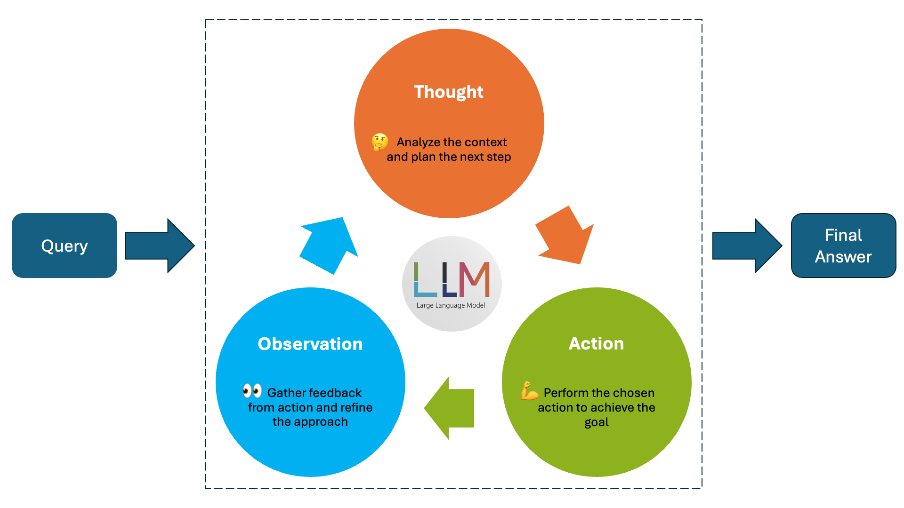
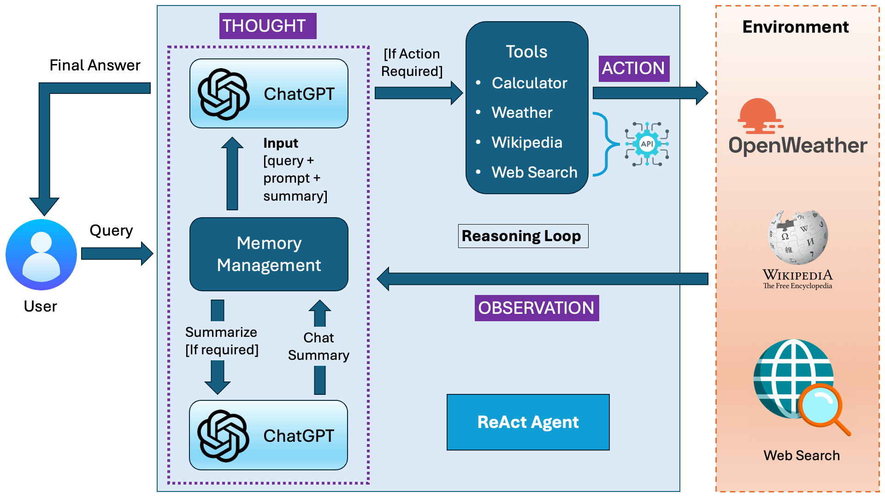
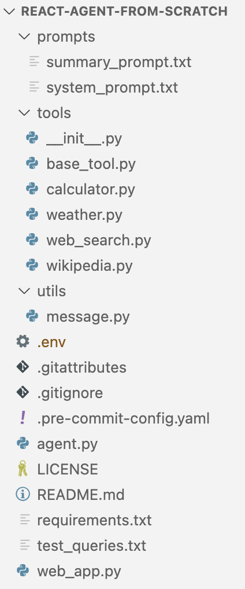
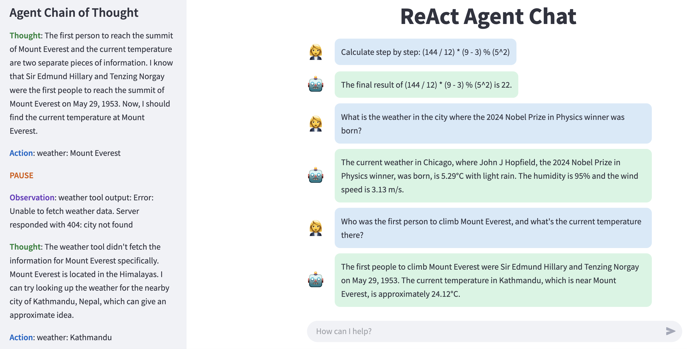

# 🧠 ReAct Agent from Scratch (No Framework)

This project walks you through building a **ReAct (Reasoning + Acting) AI Agent** entirely from scratch in Python, **without using LangChain, LlamaIndex, or any external framework**. The result is a fully customizable and transparent system capable of complex reasoning and tool use, wrapped in a user-friendly web interface built with Streamlit.

---

## 🔍 Why Build a ReAct Agent from Scratch?

Most AI frameworks abstract away the core reasoning and decision-making logic, which limits your understanding and flexibility. This project is ideal if you want to:

- **Deeply understand** how AI agents think, act, and reason.
- **Customize** every part of your agent, including how it uses tools and handles memory.
- **Learn the inner workings** of ReAct architecture and step-by-step execution.
- **Avoid framework overhead**, allowing better performance and clarity.

By building from scratch, you'll take complete control of your agent's behavior and gain real insight into the reasoning-action-observation loop that powers modern AI agents.

---

## 🤖 What is a ReAct AI Agent?

A **ReAct Agent** (short for **Reasoning + Acting**) is a next-gen AI model that doesn’t just respond with static answers—it **thinks, takes actions using tools**, and **adapts its response** in real time.

Unlike traditional chatbots that rely on predefined rules or one-shot responses, a ReAct agent dynamically interacts with tools like:

- 🧮 Calculator
- 🌐 Wikipedia
- 🔍 Web Search
- 🌦️ Weather APIs

This allows the agent to **solve multi-step problems**, **correct itself**, and **deliver accurate, up-to-date answers**.

---

## 💡 Why ReAct Is Better Than Traditional AI Agents

| Feature           | Traditional AI Agents          | ReAct AI Agents                         |
|------------------|--------------------------------|------------------------------------------|
| Answer retrieval | Direct response                | Step-by-step reasoning                   |
| Decision-making  | Rule-based or limited          | Adaptive and context-aware               |
| Tool usage       | Static, predefined             | Real-time API access via tools           |
| Self-correction  | ❌ No                         | ✅ Yes – adjusts based on new info       |

> ReAct Agents are ideal for complex reasoning tasks like:  
> _"What’s the weather in the city where the 2024 Nobel Prize in Physics winner was born?"_

A traditional agent fails here, but a ReAct agent:
1. Finds the Nobel winner  
2. Determines their birthplace  
3. Looks up the weather in that location  
4. Returns a refined, complete answer

---
## 🔍 Inside the ReAct Agent: A Step-by-Step Breakdown

Unlike traditional AI models that return static answers, a **ReAct Agent** follows a structured loop—**Thought → Action → PAUSE → Observation**—to reason step by step, interact with external tools, and refine its responses dynamically.

### 🔁 ReAct Loop




### 🧠 Thought – Reasoning Before Acting

The agent first interprets the user query and plans what to do. It breaks the problem into smaller tasks, decides the right tool, and prepares for action.

> **Example Query:**  
> *"Who discovered gravity, and what’s the weather where he was born?"*  
> → Thought: “Find the scientist → Find birthplace → Check weather.”

---

### ⚡ Action – Using Tools

Once the agent decides, it performs an action using a tool like:

- `wikipedia` – factual info  
- `web_search` – real-time search  
- `weather` – live weather data  
- `calculator` – math ops

> **Example:**  
> `Action: wikipedia: "Who discovered gravity?"`

---

### ⏸️ PAUSE – Wait for Results

After the action, the agent pauses and waits for the result. This ensures it doesn’t assume or guess and can respond based on real data.

---

### 👀 Observation – React and Refine

The agent receives a result, evaluates it, and decides the next step. It may take another action or move toward a final answer.

> **Observation:** "Isaac Newton discovered gravity."  
> → Next Thought: "Where was Newton born?"

---

### 🔄 Full Loop Example

1. **Thought:** Find who discovered gravity  
2. **Action:** `wikipedia: "Who discovered gravity?"`  
3. **Observation:** Isaac Newton  
4. **Thought:** Find Newton’s birthplace  
5. **Action:** `wikipedia: "Isaac Newton birthplace"`  
6. **Observation:** Woolsthorpe, England  
7. **Thought:** Get weather in Woolsthorpe  
8. **Action:** `weather: "Woolsthorpe"`  
9. **Observation:** "10°C, clear"  
10. **Final Answer:** Newton was born in Woolsthorpe. The current weather is 10°C and clear.

This loop-based approach makes the ReAct Agent **adaptive, intelligent, and capable of solving multi-step queries** with high accuracy and transparency.

---

## 🏗️ Architecture of the ReAct Agent

The ReAct agent is built to think, act, observe, and refine its answers using a loop-driven architecture. It breaks complex problems into steps, leverages external tools, and dynamically updates its reasoning.

---

### 🖼️ System Architecture Overview



The architecture consists of six core stages:

1. **User Input & Query Processing**  
2. **Thought Process (Reasoning & Memory)**  
3. **Action Execution (Tool Usage)**  
4. **Environment Interaction (APIs)**  
5. **Observation Loop**  
6. **Final Answer Generation**

---

### 1️⃣ Query Processing

The process starts with the user's question. It can range from basic knowledge to real-time weather or multi-hop queries. The agent first decides whether the answer requires memory, reasoning, or tools.

---

### 2️⃣ Thought & Reasoning

ChatGPT acts as the brain. It:

- Understands the query
- Breaks it down logically
- Checks past interactions (memory)
- Plans what to do next

---

### 3️⃣ Memory & Token Management

To handle long conversations, the agent:

- Stores past queries, thoughts, and observations
- Summarizes older messages when hitting token limits
- Keeps the context relevant and concise

---

### 4️⃣ External Tools (Environment)

The agent interacts with real-world APIs like:

- `Wikipedia` – factual knowledge  
- `Web Search` – latest info  
- `Weather` – live conditions  
- `Calculator` – math tasks

It uses the right tool based on what the LLM deems necessary.

---

### 5️⃣ Observation & Reasoning Loop

After a tool returns data:

- The agent reviews the result
- Decides if more info is needed
- May repeat the Thought → Action → Observation cycle

This loop continues until the query is fully answered.

---

### 6️⃣ Final Answer Generation

Once all data is collected:

- Results are merged and formatted clearly
- Irrelevant steps are skipped
- A concise, readable final answer is presented

> **Example:**  
> “John Smith won the 2024 Nobel Prize in Physics. He was born in Stockholm. The weather in Stockholm is 12°C, clear skies.”

This modular architecture makes the ReAct Agent **robust, explainable, and easy to extend**, whether you’re adding new tools or improving decision logic.

---

### 🧰 Project Structure


---


## ⚙️ Setting Up the Project

To get started with the ReAct Agent, ensure you're using **Python 3.8 or higher**. It’s recommended to use a virtual environment to keep dependencies isolated.

---


### 1. Clone the repo

```bash
git clone git@github.com:shafiqul-islam-sumon/ReAct-Agent-from-Scratch.git
cd ReAct-Agent-from-Scratch
```

### 2. Install dependencies

```bash
pip install -r requirements.txt
```

### 3. Run ReAct Agent

```bash
python agent.py
```

### 4. Run the Streamlit Web App

```bash
streamlit run web_app.py
```

## 🖥️ Creating a Web Interface (Streamlit)

To make the ReAct Agent more accessible and user-friendly, a web interface is built using **Streamlit**. This allows users to interact with the agent in natural language and view its full reasoning process in real time.

### ⚙️ Layout of the UI

The web interface is structured into three key sections:

- **💬 Main Chat Panel**: Displays the user's query and the agent's final response in a conversational style.
- **📊 Sidebar (Chain of Thought)**: Shows the internal reasoning loop — including `Thought`, `Action`, `PAUSE`, `Observation`, and `Final Answer` — step by step.
- **⌨️ Input Box**: A text field for submitting queries (e.g., "What is the weather in Tokyo?").

### 📸 Interface Preview



---

## 🧠 Example : Weather in the Birth City of a Nobel Laureate

In this example, the user asks a complex query that requires **reasoning over multiple steps**. The agent must:

- Identify the winner of the 2024 Nobel Prize in Physics
- Determine the birth city of the winner
- Retrieve the weather for that city

This showcases the ReAct agent’s ability to handle multi-hop reasoning using external tools.

**User Prompt**:
```
What is the weather in the city where the 2024 Nobel Prize in Physics winner was born?
```

**Agent's Step-by-Step Reasoning**:
```plaintext

[ASSISTANT]: Thought: I need to determine the winner of the 2024 Nobel Prize in Physics and then find the city where the laureate was born. After that, I can check the weather in that city.


[ACTION]: web_search: 2024 Nobel Prize in Physics winner

[PAUSE]:


[SYSTEM]: Observation: web_search tool output: [{'title': 'All Nobel Prizes 2024 - NobelPrize.org', 'content': 'Nobel Prizes & laureates All Nobel Prizes All Nobel Prizes 2024 About the prize NOBEL PRIZES 2024 The Nobel Prize in Physics 2024 The Nobel Prize in Chemistry 2024 The Nobel Prize in Literature 2024 The Nobel Prize in Literature 2024 is awarded to the South Korean author Han Kang, “for her intense poetic prose that confronts historical traumas and exposes the fragility of human life.” The Nobel Peace Prize 2024 Nobel Prize laureates 2024 Nobel Prize in Physics 2024 Nobel Prize in Physics 2024 Nobel Prize in Chemistry 2024 Nobel Prize in Chemistry 2024 Nobel Prize in Chemistry 2024 Nobel Prize in Literature 2024 Nobel Peace Prize 2024 About the Nobel Prize organisation Nobel Prize', 'url': 'https://www.nobelprize.org/all-nobel-prizes-2024/', 'score': 0.8719229}, {'title': 'The Nobel Prize in Physics 2024 - NobelPrize.org', 'content': 'The Nobel Prize in Physics 2024 - NobelPrize.org Nobel Prizes & laureates All Nobel Prizes All Nobel Prizes 2024 Physics prize Chemistry prize Medicine prize Literature prize Peace prize About the prize Nobel Prize in Physics 2024 Nobel Prize in Physics 2024 © Nobel Prize Outreach. Prize share: 1/2 © Nobel Prize Outreach. The Nobel Prize in Physics 2024 was awarded jointly to John J. Nobel Prize Outreach 2025. Nobel Prizes and laureates Nobel Prizes 2024 Explore prizes and laureates Look for popular awards and laureates in different fields, and discover the history of the Nobel Prize. About the Nobel Prize organisation For more than a century, these academic institutions have worked independently to select Nobel Prize laureates. Nobel Prize', 'url': 'https://www.nobelprize.org/prizes/physics/2024/summary/Â/', 'score': 0.81025416}]


[ASSISTANT]: Thought: From the search results, it appears that the information about the 2024 Nobel Prize in Physics winner might be found on NobelPrize.org. I will now look up the specific page for the 2024 Nobel Prize in Physics to find out the winner and their birthplace.


[ACTION]: web_search: The Nobel Prize in Physics 2024 winner's birthplace

[PAUSE]:


[SYSTEM]: Observation: web_search tool output: [{'title': 'The Nobel Prize in Physics 2024 - Popular science background ...', 'content': 'The Royal Swedish Academy of Sciences has decided to award the Nobel Prize in Physics 2024 to. JOHN J. HOPFIELD Born 1933 in Chicago, IL, USA. PhD 1958 from Cornell University, Ithaca, NY, USA. Professor at Princeton University, NJ, USA. GEOFFREY HINTON Born 1947 in London, UK. PhD 1978 from The University of Edinburgh, UK.', 'url': 'https://www.nobelprize.org/prizes/physics/2024/popular-information/?hidden=true/', 'score': 0.8690161}, {'title': 'Press release: The Nobel Prize in Physics 2024 - NobelPrize.org', 'content': 'Press release: The Nobel Prize in Physics 2024 - NobelPrize.org Nobel Prizes & laureates All Nobel Prizes All Nobel Prizes 2024 Physics prize About the prize Nobel Prize in Physics 2024 The Royal Swedish Academy of Sciences has decided to award the Nobel Prize in Physics 2024 to This year’s two Nobel Laureates in Physics have used tools from physics to develop methods that are the foundation of today’s powerful machine learning. Illustration: The Nobel Prize in Physics 2024 (pdf) Nobel Prize Outreach 2025. <https://www.nobelprize.org/prizes/physics/2024/press-release/> Nobel Prizes and laureates Nobel Prizes 2024 Look for popular awards and laureates in different fields, and discover the history of the Nobel Prize. About the Nobel Prize organisation Nobel Prize', 'url': 'https://www.nobelprize.org/prizes/physics/2024/press-release/', 'score': 0.35367426}]


[ASSISTANT]: Thought: The 2024 Nobel Prize in Physics was awarded to John J. Hopfield and Geoffrey Hinton. John J. Hopfield was born in Chicago, IL, USA, and Geoffrey Hinton was born in London, UK. To find the weather, I can choose either city. I will proceed to check the weather for Chicago.


[ACTION]: weather: Chicago

[PAUSE]:


[SYSTEM]: Observation: weather tool output: The temperature in Chicago is 6.46°C. The weather is thunderstorm. The humidity is 94%. The wind speed is 2.57 m/s.


[ASSISTANT]:
[FINAL ANSWER]: The weather in Chicago, where John J. Hopfield, the 2024 Nobel Prize in Physics winner, was born, is currently 6.46°C with a thunderstorm. The humidity is 94%, and the wind speed is 2.57 m/s.
```

---

### 🔍 Step 1: Discover the Winner

The agent uses the `web_search` tool to look up the 2024 Nobel Prize in Physics.  
From the search results, it identifies:
- **John J. Hopfield**, born in **Chicago, USA**
- **Geoffrey Hinton**, born in **London, UK**

The agent decides to proceed with **Chicago**.

---

### 🌦️ Step 2: Retrieve Weather Data

The agent invokes the `weather` tool to get the weather in **Chicago**.

**Weather in Chicago:**
- Temperature: **6.46°C**
- Condition: **Thunderstorm**
- Humidity: **94%**
- Wind Speed: **2.57 m/s**

---

### ✅ Final Answer

The weather in **Chicago**, where **John J. Hopfield**, one of the 2024 Nobel Prize in Physics winners, was born, is:
- **6.46°C** with a **thunderstorm**
- **Humidity**: 94%
- **Wind Speed**: 2.57 m/s

This example demonstrates the ReAct agent’s multi-hop reasoning capabilities — combining knowledge retrieval and real-time data via tool usage.

---

## 📖 Full Blog Post

For a full breakdown of this multi-step reasoning and how the ReAct agent processes the prompt, read the detailed article:

👉 [Creating a ReAct AI Agent from Scratch using Python (No Framework)](https://shafiqulai.github.io/blogs/blog_3.html?id=3)
